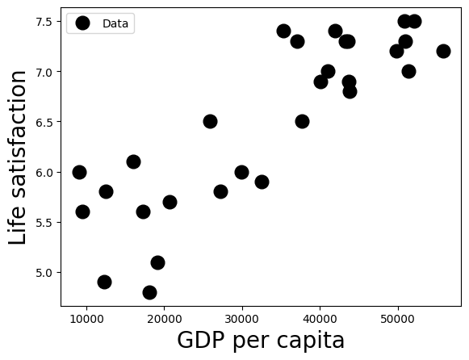
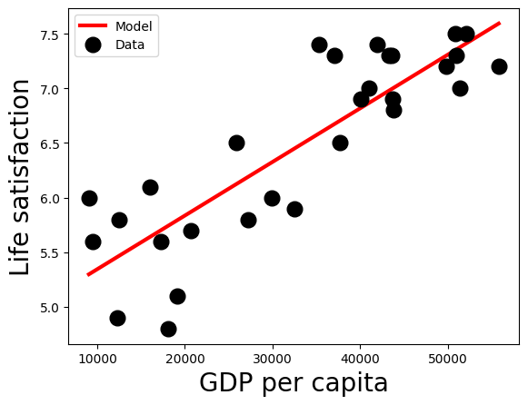

# Laboratory Session 1: Machine Learning Landscape


# The Data: Life Satisfaction and GDP per capita
## Life satisfaction data description
This dataset was obtained from the OECD's website at: http://stats.oecd.org/index.aspx?DataSetCode=BLI

```
Int64Index: 3292 entries, 0 to 3291
Data columns (total 17 columns):
"LOCATION"              3292 non-null object
Country                  3292 non-null object
INDICATOR                3292 non-null object
Indicator                3292 non-null object
MEASURE                  3292 non-null object
Measure                  3292 non-null object
INEQUALITY               3292 non-null object
Inequality               3292 non-null object
Unit Code                3292 non-null object
Unit                     3292 non-null object
PowerCode Code           3292 non-null int64
PowerCode                3292 non-null object
Reference Period Code    0 non-null float64
Reference Period         0 non-null float64
Value                    3292 non-null float64
Flag Codes               1120 non-null object
Flags                    1120 non-null object
dtypes: float64(3), int64(1), object(13)
memory usage: 462.9+ KB
```

### Example using Python Pandas

```
>>> life_sat = pd.read_csv("oecd_bli_2015.csv", thousands=',')

>>> life_sat_total = life_sat[life_sat["INEQUALITY"]=="TOT"]

>>> life_sat_total = life_sat_total.pivot(index="Country", columns="Indicator", values="Value")

>>> life_sat_total.info()
<class 'pandas.core.frame.DataFrame'>
Index: 37 entries, Australia to United States
Data columns (total 24 columns):
Air pollution                                37 non-null float64
Assault rate                                 37 non-null float64
Consultation on rule-making                  37 non-null float64
Dwellings without basic facilities           37 non-null float64
Educational attainment                       37 non-null float64
Employees working very long hours            37 non-null float64
Employment rate                              37 non-null float64
Homicide rate                                37 non-null float64
Household net adjusted disposable income     37 non-null float64
Household net financial wealth               37 non-null float64
Housing expenditure                          37 non-null float64
Job security                                 37 non-null float64
Life expectancy                              37 non-null float64
Life satisfaction                            37 non-null float64
Long-term unemployment rate                  37 non-null float64
Personal earnings                            37 non-null float64
Quality of support network                   37 non-null float64
Rooms per person                             37 non-null float64
Self-reported health                         37 non-null float64
Student skills                               37 non-null float64
Time devoted to leisure and personal care    37 non-null float64
Voter turnout                                37 non-null float64
Water quality                                37 non-null float64
Years in education                           37 non-null float64
dtypes: float64(24)
memory usage: 7.2+ KB
```


```python
# Load the data
import numpy as np
import pandas as pd
oecd_bli = pd.read_csv("oecd_bli_2015.csv", thousands=',')
life_sat_total = oecd_bli[oecd_bli["INEQUALITY"]=="TOT"]
life_sat_total.info()
new = life_sat_total[life_sat_total["Country"]=='Austria']
new
```

    <class 'pandas.core.frame.DataFrame'>
    Int64Index: 888 entries, 0 to 3217
    Data columns (total 17 columns):
     #   Column                 Non-Null Count  Dtype  
    ---  ------                 --------------  -----  
     0   LOCATION               888 non-null    object 
     1   Country                888 non-null    object 
     2   INDICATOR              888 non-null    object 
     3   Indicator              888 non-null    object 
     4   MEASURE                888 non-null    object 
     5   Measure                888 non-null    object 
     6   INEQUALITY             888 non-null    object 
     7   Inequality             888 non-null    object 
     8   Unit Code              888 non-null    object 
     9   Unit                   888 non-null    object 
     10  PowerCode Code         888 non-null    int64  
     11  PowerCode              888 non-null    object 
     12  Reference Period Code  0 non-null      float64
     13  Reference Period       0 non-null      float64
     14  Value                  888 non-null    float64
     15  Flag Codes             58 non-null     object 
     16  Flags                  58 non-null     object 
    dtypes: float64(3), int64(1), object(13)
    memory usage: 124.9+ KB


<div>
<style scoped>
    .dataframe tbody tr th:only-of-type {
        vertical-align: middle;
    }

    .dataframe tbody tr th {
        vertical-align: top;
    }

    .dataframe thead th {
        text-align: right;
    }
</style>
<table border="1" class="dataframe">
  <thead>
    <tr style="text-align: right;">
      <th></th>
      <th>LOCATION</th>
      <th>Country</th>
      <th>INDICATOR</th>
      <th>Indicator</th>
      <th>MEASURE</th>
      <th>Measure</th>
      <th>INEQUALITY</th>
      <th>Inequality</th>
      <th>Unit Code</th>
      <th>Unit</th>
      <th>PowerCode Code</th>
      <th>PowerCode</th>
      <th>Reference Period Code</th>
      <th>Reference Period</th>
      <th>Value</th>
      <th>Flag Codes</th>
      <th>Flags</th>
    </tr>
  </thead>
  <tbody>
    <tr>
      <th>1</th>
      <td>AUT</td>
      <td>Austria</td>
      <td>HO_BASE</td>
      <td>Dwellings without basic facilities</td>
      <td>L</td>
      <td>Value</td>
      <td>TOT</td>
      <td>Total</td>
      <td>PC</td>
      <td>Percentage</td>
      <td>0</td>
      <td>units</td>
      <td>NaN</td>
      <td>NaN</td>
      <td>1.00</td>
      <td>NaN</td>
      <td>NaN</td>
    </tr>
    <tr>
      <th>110</th>
      <td>AUT</td>
      <td>Austria</td>
      <td>HO_HISH</td>
      <td>Housing expenditure</td>
      <td>L</td>
      <td>Value</td>
      <td>TOT</td>
      <td>Total</td>
      <td>PC</td>
      <td>Percentage</td>
      <td>0</td>
      <td>units</td>
      <td>NaN</td>
      <td>NaN</td>
      <td>21.00</td>
      <td>NaN</td>
      <td>NaN</td>
    </tr>
    <tr>
      <th>219</th>
      <td>AUT</td>
      <td>Austria</td>
      <td>HO_NUMR</td>
      <td>Rooms per person</td>
      <td>L</td>
      <td>Value</td>
      <td>TOT</td>
      <td>Total</td>
      <td>RATIO</td>
      <td>Ratio</td>
      <td>0</td>
      <td>units</td>
      <td>NaN</td>
      <td>NaN</td>
      <td>1.60</td>
      <td>NaN</td>
      <td>NaN</td>
    </tr>
    <tr>
      <th>328</th>
      <td>AUT</td>
      <td>Austria</td>
      <td>IW_HADI</td>
      <td>Household net adjusted disposable income</td>
      <td>L</td>
      <td>Value</td>
      <td>TOT</td>
      <td>Total</td>
      <td>USD</td>
      <td>US Dollar</td>
      <td>0</td>
      <td>units</td>
      <td>NaN</td>
      <td>NaN</td>
      <td>31173.00</td>
      <td>NaN</td>
      <td>NaN</td>
    </tr>
    <tr>
      <th>511</th>
      <td>AUT</td>
      <td>Austria</td>
      <td>IW_HNFW</td>
      <td>Household net financial wealth</td>
      <td>L</td>
      <td>Value</td>
      <td>TOT</td>
      <td>Total</td>
      <td>USD</td>
      <td>US Dollar</td>
      <td>0</td>
      <td>units</td>
      <td>NaN</td>
      <td>NaN</td>
      <td>49887.00</td>
      <td>NaN</td>
      <td>NaN</td>
    </tr>
    <tr>
      <th>620</th>
      <td>AUT</td>
      <td>Austria</td>
      <td>JE_EMPL</td>
      <td>Employment rate</td>
      <td>L</td>
      <td>Value</td>
      <td>TOT</td>
      <td>Total</td>
      <td>PC</td>
      <td>Percentage</td>
      <td>0</td>
      <td>units</td>
      <td>NaN</td>
      <td>NaN</td>
      <td>72.00</td>
      <td>NaN</td>
      <td>NaN</td>
    </tr>
    <tr>
      <th>805</th>
      <td>AUT</td>
      <td>Austria</td>
      <td>JE_JT</td>
      <td>Job security</td>
      <td>L</td>
      <td>Value</td>
      <td>TOT</td>
      <td>Total</td>
      <td>PC</td>
      <td>Percentage</td>
      <td>0</td>
      <td>units</td>
      <td>NaN</td>
      <td>NaN</td>
      <td>3.90</td>
      <td>NaN</td>
      <td>NaN</td>
    </tr>
    <tr>
      <th>916</th>
      <td>AUT</td>
      <td>Austria</td>
      <td>JE_LTUR</td>
      <td>Long-term unemployment rate</td>
      <td>L</td>
      <td>Value</td>
      <td>TOT</td>
      <td>Total</td>
      <td>PC</td>
      <td>Percentage</td>
      <td>0</td>
      <td>units</td>
      <td>NaN</td>
      <td>NaN</td>
      <td>1.19</td>
      <td>NaN</td>
      <td>NaN</td>
    </tr>
    <tr>
      <th>1101</th>
      <td>AUT</td>
      <td>Austria</td>
      <td>JE_PEARN</td>
      <td>Personal earnings</td>
      <td>L</td>
      <td>Value</td>
      <td>TOT</td>
      <td>Total</td>
      <td>USD</td>
      <td>US Dollar</td>
      <td>0</td>
      <td>units</td>
      <td>NaN</td>
      <td>NaN</td>
      <td>45199.00</td>
      <td>NaN</td>
      <td>NaN</td>
    </tr>
    <tr>
      <th>1286</th>
      <td>AUT</td>
      <td>Austria</td>
      <td>SC_SNTWS</td>
      <td>Quality of support network</td>
      <td>L</td>
      <td>Value</td>
      <td>TOT</td>
      <td>Total</td>
      <td>PC</td>
      <td>Percentage</td>
      <td>0</td>
      <td>units</td>
      <td>NaN</td>
      <td>NaN</td>
      <td>89.00</td>
      <td>NaN</td>
      <td>NaN</td>
    </tr>
    <tr>
      <th>1453</th>
      <td>AUT</td>
      <td>Austria</td>
      <td>ES_EDUA</td>
      <td>Educational attainment</td>
      <td>L</td>
      <td>Value</td>
      <td>TOT</td>
      <td>Total</td>
      <td>PC</td>
      <td>Percentage</td>
      <td>0</td>
      <td>units</td>
      <td>NaN</td>
      <td>NaN</td>
      <td>83.00</td>
      <td>NaN</td>
      <td>NaN</td>
    </tr>
    <tr>
      <th>1564</th>
      <td>AUT</td>
      <td>Austria</td>
      <td>ES_STCS</td>
      <td>Student skills</td>
      <td>L</td>
      <td>Value</td>
      <td>TOT</td>
      <td>Total</td>
      <td>AVSCORE</td>
      <td>Average score</td>
      <td>0</td>
      <td>units</td>
      <td>NaN</td>
      <td>NaN</td>
      <td>500.00</td>
      <td>NaN</td>
      <td>NaN</td>
    </tr>
    <tr>
      <th>1749</th>
      <td>AUT</td>
      <td>Austria</td>
      <td>ES_EDUEX</td>
      <td>Years in education</td>
      <td>L</td>
      <td>Value</td>
      <td>TOT</td>
      <td>Total</td>
      <td>YR</td>
      <td>Years</td>
      <td>0</td>
      <td>units</td>
      <td>NaN</td>
      <td>NaN</td>
      <td>17.00</td>
      <td>NaN</td>
      <td>NaN</td>
    </tr>
    <tr>
      <th>1860</th>
      <td>AUT</td>
      <td>Austria</td>
      <td>EQ_AIRP</td>
      <td>Air pollution</td>
      <td>L</td>
      <td>Value</td>
      <td>TOT</td>
      <td>Total</td>
      <td>MICRO_M3</td>
      <td>Micrograms per cubic metre</td>
      <td>0</td>
      <td>units</td>
      <td>NaN</td>
      <td>NaN</td>
      <td>27.00</td>
      <td>NaN</td>
      <td>NaN</td>
    </tr>
    <tr>
      <th>1969</th>
      <td>AUT</td>
      <td>Austria</td>
      <td>EQ_WATER</td>
      <td>Water quality</td>
      <td>L</td>
      <td>Value</td>
      <td>TOT</td>
      <td>Total</td>
      <td>PC</td>
      <td>Percentage</td>
      <td>0</td>
      <td>units</td>
      <td>NaN</td>
      <td>NaN</td>
      <td>94.00</td>
      <td>NaN</td>
      <td>NaN</td>
    </tr>
    <tr>
      <th>2080</th>
      <td>AUT</td>
      <td>Austria</td>
      <td>CG_TRASG</td>
      <td>Consultation on rule-making</td>
      <td>L</td>
      <td>Value</td>
      <td>TOT</td>
      <td>Total</td>
      <td>AVSCORE</td>
      <td>Average score</td>
      <td>0</td>
      <td>units</td>
      <td>NaN</td>
      <td>NaN</td>
      <td>7.10</td>
      <td>NaN</td>
      <td>NaN</td>
    </tr>
    <tr>
      <th>2189</th>
      <td>AUT</td>
      <td>Austria</td>
      <td>CG_VOTO</td>
      <td>Voter turnout</td>
      <td>L</td>
      <td>Value</td>
      <td>TOT</td>
      <td>Total</td>
      <td>PC</td>
      <td>Percentage</td>
      <td>0</td>
      <td>units</td>
      <td>NaN</td>
      <td>NaN</td>
      <td>75.00</td>
      <td>NaN</td>
      <td>NaN</td>
    </tr>
    <tr>
      <th>2374</th>
      <td>AUT</td>
      <td>Austria</td>
      <td>HS_LEB</td>
      <td>Life expectancy</td>
      <td>L</td>
      <td>Value</td>
      <td>TOT</td>
      <td>Total</td>
      <td>YR</td>
      <td>Years</td>
      <td>0</td>
      <td>units</td>
      <td>NaN</td>
      <td>NaN</td>
      <td>81.00</td>
      <td>NaN</td>
      <td>NaN</td>
    </tr>
    <tr>
      <th>2485</th>
      <td>AUT</td>
      <td>Austria</td>
      <td>HS_SFRH</td>
      <td>Self-reported health</td>
      <td>L</td>
      <td>Value</td>
      <td>TOT</td>
      <td>Total</td>
      <td>PC</td>
      <td>Percentage</td>
      <td>0</td>
      <td>units</td>
      <td>NaN</td>
      <td>NaN</td>
      <td>69.00</td>
      <td>NaN</td>
      <td>NaN</td>
    </tr>
    <tr>
      <th>2670</th>
      <td>AUT</td>
      <td>Austria</td>
      <td>SW_LIFS</td>
      <td>Life satisfaction</td>
      <td>L</td>
      <td>Value</td>
      <td>TOT</td>
      <td>Total</td>
      <td>AVSCORE</td>
      <td>Average score</td>
      <td>0</td>
      <td>units</td>
      <td>NaN</td>
      <td>NaN</td>
      <td>6.90</td>
      <td>NaN</td>
      <td>NaN</td>
    </tr>
    <tr>
      <th>2849</th>
      <td>AUT</td>
      <td>Austria</td>
      <td>PS_SFRV</td>
      <td>Assault rate</td>
      <td>L</td>
      <td>Value</td>
      <td>TOT</td>
      <td>Total</td>
      <td>PC</td>
      <td>Percentage</td>
      <td>0</td>
      <td>units</td>
      <td>NaN</td>
      <td>NaN</td>
      <td>3.40</td>
      <td>NaN</td>
      <td>NaN</td>
    </tr>
    <tr>
      <th>2960</th>
      <td>AUT</td>
      <td>Austria</td>
      <td>PS_REPH</td>
      <td>Homicide rate</td>
      <td>L</td>
      <td>Value</td>
      <td>TOT</td>
      <td>Total</td>
      <td>RATIO</td>
      <td>Ratio</td>
      <td>0</td>
      <td>units</td>
      <td>NaN</td>
      <td>NaN</td>
      <td>0.40</td>
      <td>NaN</td>
      <td>NaN</td>
    </tr>
    <tr>
      <th>3071</th>
      <td>AUT</td>
      <td>Austria</td>
      <td>WL_EWLH</td>
      <td>Employees working very long hours</td>
      <td>L</td>
      <td>Value</td>
      <td>TOT</td>
      <td>Total</td>
      <td>PC</td>
      <td>Percentage</td>
      <td>0</td>
      <td>units</td>
      <td>NaN</td>
      <td>NaN</td>
      <td>7.61</td>
      <td>NaN</td>
      <td>NaN</td>
    </tr>
    <tr>
      <th>3182</th>
      <td>AUT</td>
      <td>Austria</td>
      <td>WL_TNOW</td>
      <td>Time devoted to leisure and personal care</td>
      <td>L</td>
      <td>Value</td>
      <td>TOT</td>
      <td>Total</td>
      <td>HOUR</td>
      <td>Hours</td>
      <td>0</td>
      <td>units</td>
      <td>NaN</td>
      <td>NaN</td>
      <td>14.46</td>
      <td>NaN</td>
      <td>NaN</td>
    </tr>
  </tbody>
</table>
</div>


```python
import pandas as pd
life_sat = pd.read_csv('oecd_bli_2015.csv', thousands=",")
life_sat_total = life_sat[life_sat["INEQUALITY"]=="TOT"]
life_sat_total
```


<div>
<style scoped>
    .dataframe tbody tr th:only-of-type {
        vertical-align: middle;
    }

    .dataframe tbody tr th {
        vertical-align: top;
    }

    .dataframe thead th {
        text-align: right;
    }
</style>
<table border="1" class="dataframe">
  <thead>
    <tr style="text-align: right;">
      <th></th>
      <th>LOCATION</th>
      <th>Country</th>
      <th>INDICATOR</th>
      <th>Indicator</th>
      <th>MEASURE</th>
      <th>Measure</th>
      <th>INEQUALITY</th>
      <th>Inequality</th>
      <th>Unit Code</th>
      <th>Unit</th>
      <th>PowerCode Code</th>
      <th>PowerCode</th>
      <th>Reference Period Code</th>
      <th>Reference Period</th>
      <th>Value</th>
      <th>Flag Codes</th>
      <th>Flags</th>
    </tr>
  </thead>
  <tbody>
    <tr>
      <th>0</th>
      <td>AUS</td>
      <td>Australia</td>
      <td>HO_BASE</td>
      <td>Dwellings without basic facilities</td>
      <td>L</td>
      <td>Value</td>
      <td>TOT</td>
      <td>Total</td>
      <td>PC</td>
      <td>Percentage</td>
      <td>0</td>
      <td>units</td>
      <td>NaN</td>
      <td>NaN</td>
      <td>1.10</td>
      <td>E</td>
      <td>Estimated value</td>
    </tr>
    <tr>
      <th>1</th>
      <td>AUT</td>
      <td>Austria</td>
      <td>HO_BASE</td>
      <td>Dwellings without basic facilities</td>
      <td>L</td>
      <td>Value</td>
      <td>TOT</td>
      <td>Total</td>
      <td>PC</td>
      <td>Percentage</td>
      <td>0</td>
      <td>units</td>
      <td>NaN</td>
      <td>NaN</td>
      <td>1.00</td>
      <td>NaN</td>
      <td>NaN</td>
    </tr>
    <tr>
      <th>2</th>
      <td>BEL</td>
      <td>Belgium</td>
      <td>HO_BASE</td>
      <td>Dwellings without basic facilities</td>
      <td>L</td>
      <td>Value</td>
      <td>TOT</td>
      <td>Total</td>
      <td>PC</td>
      <td>Percentage</td>
      <td>0</td>
      <td>units</td>
      <td>NaN</td>
      <td>NaN</td>
      <td>2.00</td>
      <td>NaN</td>
      <td>NaN</td>
    </tr>
    <tr>
      <th>3</th>
      <td>CAN</td>
      <td>Canada</td>
      <td>HO_BASE</td>
      <td>Dwellings without basic facilities</td>
      <td>L</td>
      <td>Value</td>
      <td>TOT</td>
      <td>Total</td>
      <td>PC</td>
      <td>Percentage</td>
      <td>0</td>
      <td>units</td>
      <td>NaN</td>
      <td>NaN</td>
      <td>0.20</td>
      <td>NaN</td>
      <td>NaN</td>
    </tr>
    <tr>
      <th>4</th>
      <td>CZE</td>
      <td>Czech Republic</td>
      <td>HO_BASE</td>
      <td>Dwellings without basic facilities</td>
      <td>L</td>
      <td>Value</td>
      <td>TOT</td>
      <td>Total</td>
      <td>PC</td>
      <td>Percentage</td>
      <td>0</td>
      <td>units</td>
      <td>NaN</td>
      <td>NaN</td>
      <td>0.90</td>
      <td>NaN</td>
      <td>NaN</td>
    </tr>
    <tr>
      <th>...</th>
      <td>...</td>
      <td>...</td>
      <td>...</td>
      <td>...</td>
      <td>...</td>
      <td>...</td>
      <td>...</td>
      <td>...</td>
      <td>...</td>
      <td>...</td>
      <td>...</td>
      <td>...</td>
      <td>...</td>
      <td>...</td>
      <td>...</td>
      <td>...</td>
      <td>...</td>
    </tr>
    <tr>
      <th>3213</th>
      <td>EST</td>
      <td>Estonia</td>
      <td>WL_TNOW</td>
      <td>Time devoted to leisure and personal care</td>
      <td>L</td>
      <td>Value</td>
      <td>TOT</td>
      <td>Total</td>
      <td>HOUR</td>
      <td>Hours</td>
      <td>0</td>
      <td>units</td>
      <td>NaN</td>
      <td>NaN</td>
      <td>14.90</td>
      <td>NaN</td>
      <td>NaN</td>
    </tr>
    <tr>
      <th>3214</th>
      <td>ISR</td>
      <td>Israel</td>
      <td>WL_TNOW</td>
      <td>Time devoted to leisure and personal care</td>
      <td>L</td>
      <td>Value</td>
      <td>TOT</td>
      <td>Total</td>
      <td>HOUR</td>
      <td>Hours</td>
      <td>0</td>
      <td>units</td>
      <td>NaN</td>
      <td>NaN</td>
      <td>14.48</td>
      <td>E</td>
      <td>Estimated value</td>
    </tr>
    <tr>
      <th>3215</th>
      <td>RUS</td>
      <td>Russia</td>
      <td>WL_TNOW</td>
      <td>Time devoted to leisure and personal care</td>
      <td>L</td>
      <td>Value</td>
      <td>TOT</td>
      <td>Total</td>
      <td>HOUR</td>
      <td>Hours</td>
      <td>0</td>
      <td>units</td>
      <td>NaN</td>
      <td>NaN</td>
      <td>14.97</td>
      <td>E</td>
      <td>Estimated value</td>
    </tr>
    <tr>
      <th>3216</th>
      <td>SVN</td>
      <td>Slovenia</td>
      <td>WL_TNOW</td>
      <td>Time devoted to leisure and personal care</td>
      <td>L</td>
      <td>Value</td>
      <td>TOT</td>
      <td>Total</td>
      <td>HOUR</td>
      <td>Hours</td>
      <td>0</td>
      <td>units</td>
      <td>NaN</td>
      <td>NaN</td>
      <td>14.62</td>
      <td>NaN</td>
      <td>NaN</td>
    </tr>
    <tr>
      <th>3217</th>
      <td>OECD</td>
      <td>OECD - Total</td>
      <td>WL_TNOW</td>
      <td>Time devoted to leisure and personal care</td>
      <td>L</td>
      <td>Value</td>
      <td>TOT</td>
      <td>Total</td>
      <td>HOUR</td>
      <td>Hours</td>
      <td>0</td>
      <td>units</td>
      <td>NaN</td>
      <td>NaN</td>
      <td>14.97</td>
      <td>NaN</td>
      <td>NaN</td>
    </tr>
  </tbody>
</table>
<p>888 rows × 17 columns</p>
</div>


```python
australia = life_sat_total[life_sat_total["Country"]=="Australia"]
australia.info()
```

    <class 'pandas.core.frame.DataFrame'>
    Int64Index: 24 entries, 0 to 3181
    Data columns (total 17 columns):
     #   Column                 Non-Null Count  Dtype  
    ---  ------                 --------------  -----  
     0   LOCATION               24 non-null     object 
     1   Country                24 non-null     object 
     2   INDICATOR              24 non-null     object 
     3   Indicator              24 non-null     object 
     4   MEASURE                24 non-null     object 
     5   Measure                24 non-null     object 
     6   INEQUALITY             24 non-null     object 
     7   Inequality             24 non-null     object 
     8   Unit Code              24 non-null     object 
     9   Unit                   24 non-null     object 
     10  PowerCode Code         24 non-null     int64  
     11  PowerCode              24 non-null     object 
     12  Reference Period Code  0 non-null      float64
     13  Reference Period       0 non-null      float64
     14  Value                  24 non-null     float64
     15  Flag Codes             2 non-null      object 
     16  Flags                  2 non-null      object 
    dtypes: float64(3), int64(1), object(13)
    memory usage: 3.4+ KB


```python
life_sat_new = life_sat_total.pivot(index="Country",
                                      columns="Indicator", values="Value")
life_sat_new
```


<div>
<style scoped>
    .dataframe tbody tr th:only-of-type {
        vertical-align: middle;
    }

    .dataframe tbody tr th {
        vertical-align: top;
    }

    .dataframe thead th {
        text-align: right;
    }
</style>
<table border="1" class="dataframe">
  <thead>
    <tr style="text-align: right;">
      <th>Indicator</th>
      <th>Air pollution</th>
      <th>Assault rate</th>
      <th>Consultation on rule-making</th>
      <th>Dwellings without basic facilities</th>
      <th>Educational attainment</th>
      <th>Employees working very long hours</th>
      <th>Employment rate</th>
      <th>Homicide rate</th>
      <th>Household net adjusted disposable income</th>
      <th>Household net financial wealth</th>
      <th>...</th>
      <th>Long-term unemployment rate</th>
      <th>Personal earnings</th>
      <th>Quality of support network</th>
      <th>Rooms per person</th>
      <th>Self-reported health</th>
      <th>Student skills</th>
      <th>Time devoted to leisure and personal care</th>
      <th>Voter turnout</th>
      <th>Water quality</th>
      <th>Years in education</th>
    </tr>
    <tr>
      <th>Country</th>
      <th></th>
      <th></th>
      <th></th>
      <th></th>
      <th></th>
      <th></th>
      <th></th>
      <th></th>
      <th></th>
      <th></th>
      <th></th>
      <th></th>
      <th></th>
      <th></th>
      <th></th>
      <th></th>
      <th></th>
      <th></th>
      <th></th>
      <th></th>
      <th></th>
    </tr>
  </thead>
  <tbody>
    <tr>
      <th>Australia</th>
      <td>13.0</td>
      <td>2.1</td>
      <td>10.5</td>
      <td>1.1</td>
      <td>76.0</td>
      <td>14.02</td>
      <td>72.0</td>
      <td>0.8</td>
      <td>31588.0</td>
      <td>47657.0</td>
      <td>...</td>
      <td>1.08</td>
      <td>50449.0</td>
      <td>92.0</td>
      <td>2.3</td>
      <td>85.0</td>
      <td>512.0</td>
      <td>14.41</td>
      <td>93.0</td>
      <td>91.0</td>
      <td>19.4</td>
    </tr>
    <tr>
      <th>Austria</th>
      <td>27.0</td>
      <td>3.4</td>
      <td>7.1</td>
      <td>1.0</td>
      <td>83.0</td>
      <td>7.61</td>
      <td>72.0</td>
      <td>0.4</td>
      <td>31173.0</td>
      <td>49887.0</td>
      <td>...</td>
      <td>1.19</td>
      <td>45199.0</td>
      <td>89.0</td>
      <td>1.6</td>
      <td>69.0</td>
      <td>500.0</td>
      <td>14.46</td>
      <td>75.0</td>
      <td>94.0</td>
      <td>17.0</td>
    </tr>
    <tr>
      <th>Belgium</th>
      <td>21.0</td>
      <td>6.6</td>
      <td>4.5</td>
      <td>2.0</td>
      <td>72.0</td>
      <td>4.57</td>
      <td>62.0</td>
      <td>1.1</td>
      <td>28307.0</td>
      <td>83876.0</td>
      <td>...</td>
      <td>3.88</td>
      <td>48082.0</td>
      <td>94.0</td>
      <td>2.2</td>
      <td>74.0</td>
      <td>509.0</td>
      <td>15.71</td>
      <td>89.0</td>
      <td>87.0</td>
      <td>18.9</td>
    </tr>
    <tr>
      <th>Brazil</th>
      <td>18.0</td>
      <td>7.9</td>
      <td>4.0</td>
      <td>6.7</td>
      <td>45.0</td>
      <td>10.41</td>
      <td>67.0</td>
      <td>25.5</td>
      <td>11664.0</td>
      <td>6844.0</td>
      <td>...</td>
      <td>1.97</td>
      <td>17177.0</td>
      <td>90.0</td>
      <td>1.6</td>
      <td>69.0</td>
      <td>402.0</td>
      <td>14.97</td>
      <td>79.0</td>
      <td>72.0</td>
      <td>16.3</td>
    </tr>
    <tr>
      <th>Canada</th>
      <td>15.0</td>
      <td>1.3</td>
      <td>10.5</td>
      <td>0.2</td>
      <td>89.0</td>
      <td>3.94</td>
      <td>72.0</td>
      <td>1.5</td>
      <td>29365.0</td>
      <td>67913.0</td>
      <td>...</td>
      <td>0.90</td>
      <td>46911.0</td>
      <td>92.0</td>
      <td>2.5</td>
      <td>89.0</td>
      <td>522.0</td>
      <td>14.25</td>
      <td>61.0</td>
      <td>91.0</td>
      <td>17.2</td>
    </tr>
    <tr>
      <th>Chile</th>
      <td>46.0</td>
      <td>6.9</td>
      <td>2.0</td>
      <td>9.4</td>
      <td>57.0</td>
      <td>15.42</td>
      <td>62.0</td>
      <td>4.4</td>
      <td>14533.0</td>
      <td>17733.0</td>
      <td>...</td>
      <td>1.59</td>
      <td>22101.0</td>
      <td>86.0</td>
      <td>1.2</td>
      <td>59.0</td>
      <td>436.0</td>
      <td>14.41</td>
      <td>49.0</td>
      <td>73.0</td>
      <td>16.5</td>
    </tr>
    <tr>
      <th>Czech Republic</th>
      <td>16.0</td>
      <td>2.8</td>
      <td>6.8</td>
      <td>0.9</td>
      <td>92.0</td>
      <td>6.98</td>
      <td>68.0</td>
      <td>0.8</td>
      <td>18404.0</td>
      <td>17299.0</td>
      <td>...</td>
      <td>3.12</td>
      <td>20338.0</td>
      <td>85.0</td>
      <td>1.4</td>
      <td>60.0</td>
      <td>500.0</td>
      <td>14.98</td>
      <td>59.0</td>
      <td>85.0</td>
      <td>18.1</td>
    </tr>
    <tr>
      <th>Denmark</th>
      <td>15.0</td>
      <td>3.9</td>
      <td>7.0</td>
      <td>0.9</td>
      <td>78.0</td>
      <td>2.03</td>
      <td>73.0</td>
      <td>0.3</td>
      <td>26491.0</td>
      <td>44488.0</td>
      <td>...</td>
      <td>1.78</td>
      <td>48347.0</td>
      <td>95.0</td>
      <td>1.9</td>
      <td>72.0</td>
      <td>498.0</td>
      <td>16.06</td>
      <td>88.0</td>
      <td>94.0</td>
      <td>19.4</td>
    </tr>
    <tr>
      <th>Estonia</th>
      <td>9.0</td>
      <td>5.5</td>
      <td>3.3</td>
      <td>8.1</td>
      <td>90.0</td>
      <td>3.30</td>
      <td>68.0</td>
      <td>4.8</td>
      <td>15167.0</td>
      <td>7680.0</td>
      <td>...</td>
      <td>3.82</td>
      <td>18944.0</td>
      <td>89.0</td>
      <td>1.5</td>
      <td>54.0</td>
      <td>526.0</td>
      <td>14.90</td>
      <td>64.0</td>
      <td>79.0</td>
      <td>17.5</td>
    </tr>
    <tr>
      <th>Finland</th>
      <td>15.0</td>
      <td>2.4</td>
      <td>9.0</td>
      <td>0.6</td>
      <td>85.0</td>
      <td>3.58</td>
      <td>69.0</td>
      <td>1.4</td>
      <td>27927.0</td>
      <td>18761.0</td>
      <td>...</td>
      <td>1.73</td>
      <td>40060.0</td>
      <td>95.0</td>
      <td>1.9</td>
      <td>65.0</td>
      <td>529.0</td>
      <td>14.89</td>
      <td>69.0</td>
      <td>94.0</td>
      <td>19.7</td>
    </tr>
    <tr>
      <th>France</th>
      <td>12.0</td>
      <td>5.0</td>
      <td>3.5</td>
      <td>0.5</td>
      <td>73.0</td>
      <td>8.15</td>
      <td>64.0</td>
      <td>0.6</td>
      <td>28799.0</td>
      <td>48741.0</td>
      <td>...</td>
      <td>3.99</td>
      <td>40242.0</td>
      <td>87.0</td>
      <td>1.8</td>
      <td>67.0</td>
      <td>500.0</td>
      <td>15.33</td>
      <td>80.0</td>
      <td>82.0</td>
      <td>16.4</td>
    </tr>
    <tr>
      <th>Germany</th>
      <td>16.0</td>
      <td>3.6</td>
      <td>4.5</td>
      <td>0.1</td>
      <td>86.0</td>
      <td>5.25</td>
      <td>73.0</td>
      <td>0.5</td>
      <td>31252.0</td>
      <td>50394.0</td>
      <td>...</td>
      <td>2.37</td>
      <td>43682.0</td>
      <td>94.0</td>
      <td>1.8</td>
      <td>65.0</td>
      <td>515.0</td>
      <td>15.31</td>
      <td>72.0</td>
      <td>95.0</td>
      <td>18.2</td>
    </tr>
    <tr>
      <th>Greece</th>
      <td>27.0</td>
      <td>3.7</td>
      <td>6.5</td>
      <td>0.7</td>
      <td>68.0</td>
      <td>6.16</td>
      <td>49.0</td>
      <td>1.6</td>
      <td>18575.0</td>
      <td>14579.0</td>
      <td>...</td>
      <td>18.39</td>
      <td>25503.0</td>
      <td>83.0</td>
      <td>1.2</td>
      <td>74.0</td>
      <td>466.0</td>
      <td>14.91</td>
      <td>64.0</td>
      <td>69.0</td>
      <td>18.6</td>
    </tr>
    <tr>
      <th>Hungary</th>
      <td>15.0</td>
      <td>3.6</td>
      <td>7.9</td>
      <td>4.8</td>
      <td>82.0</td>
      <td>3.19</td>
      <td>58.0</td>
      <td>1.3</td>
      <td>15442.0</td>
      <td>13277.0</td>
      <td>...</td>
      <td>5.10</td>
      <td>20948.0</td>
      <td>87.0</td>
      <td>1.1</td>
      <td>57.0</td>
      <td>487.0</td>
      <td>15.04</td>
      <td>62.0</td>
      <td>77.0</td>
      <td>17.6</td>
    </tr>
    <tr>
      <th>Iceland</th>
      <td>18.0</td>
      <td>2.7</td>
      <td>5.1</td>
      <td>0.4</td>
      <td>71.0</td>
      <td>12.25</td>
      <td>82.0</td>
      <td>0.3</td>
      <td>23965.0</td>
      <td>43045.0</td>
      <td>...</td>
      <td>1.18</td>
      <td>55716.0</td>
      <td>96.0</td>
      <td>1.5</td>
      <td>77.0</td>
      <td>484.0</td>
      <td>14.61</td>
      <td>81.0</td>
      <td>97.0</td>
      <td>19.8</td>
    </tr>
    <tr>
      <th>Ireland</th>
      <td>13.0</td>
      <td>2.6</td>
      <td>9.0</td>
      <td>0.2</td>
      <td>75.0</td>
      <td>4.20</td>
      <td>60.0</td>
      <td>0.8</td>
      <td>23917.0</td>
      <td>31580.0</td>
      <td>...</td>
      <td>8.39</td>
      <td>49506.0</td>
      <td>96.0</td>
      <td>2.1</td>
      <td>82.0</td>
      <td>516.0</td>
      <td>15.19</td>
      <td>70.0</td>
      <td>80.0</td>
      <td>17.6</td>
    </tr>
    <tr>
      <th>Israel</th>
      <td>21.0</td>
      <td>6.4</td>
      <td>2.5</td>
      <td>3.7</td>
      <td>85.0</td>
      <td>16.03</td>
      <td>67.0</td>
      <td>2.3</td>
      <td>22104.0</td>
      <td>52933.0</td>
      <td>...</td>
      <td>0.79</td>
      <td>28817.0</td>
      <td>87.0</td>
      <td>1.2</td>
      <td>80.0</td>
      <td>474.0</td>
      <td>14.48</td>
      <td>68.0</td>
      <td>68.0</td>
      <td>15.8</td>
    </tr>
    <tr>
      <th>Italy</th>
      <td>21.0</td>
      <td>4.7</td>
      <td>5.0</td>
      <td>1.1</td>
      <td>57.0</td>
      <td>3.66</td>
      <td>56.0</td>
      <td>0.7</td>
      <td>25166.0</td>
      <td>54987.0</td>
      <td>...</td>
      <td>6.94</td>
      <td>34561.0</td>
      <td>90.0</td>
      <td>1.4</td>
      <td>66.0</td>
      <td>490.0</td>
      <td>14.98</td>
      <td>75.0</td>
      <td>71.0</td>
      <td>16.8</td>
    </tr>
    <tr>
      <th>Japan</th>
      <td>24.0</td>
      <td>1.4</td>
      <td>7.3</td>
      <td>6.4</td>
      <td>94.0</td>
      <td>22.26</td>
      <td>72.0</td>
      <td>0.3</td>
      <td>26111.0</td>
      <td>86764.0</td>
      <td>...</td>
      <td>1.67</td>
      <td>35405.0</td>
      <td>89.0</td>
      <td>1.8</td>
      <td>30.0</td>
      <td>540.0</td>
      <td>14.93</td>
      <td>53.0</td>
      <td>85.0</td>
      <td>16.3</td>
    </tr>
    <tr>
      <th>Korea</th>
      <td>30.0</td>
      <td>2.1</td>
      <td>10.4</td>
      <td>4.2</td>
      <td>82.0</td>
      <td>18.72</td>
      <td>64.0</td>
      <td>1.1</td>
      <td>19510.0</td>
      <td>29091.0</td>
      <td>...</td>
      <td>0.01</td>
      <td>36354.0</td>
      <td>72.0</td>
      <td>1.4</td>
      <td>35.0</td>
      <td>542.0</td>
      <td>14.63</td>
      <td>76.0</td>
      <td>78.0</td>
      <td>17.5</td>
    </tr>
    <tr>
      <th>Luxembourg</th>
      <td>12.0</td>
      <td>4.3</td>
      <td>6.0</td>
      <td>0.1</td>
      <td>78.0</td>
      <td>3.47</td>
      <td>66.0</td>
      <td>0.4</td>
      <td>38951.0</td>
      <td>61765.0</td>
      <td>...</td>
      <td>1.78</td>
      <td>56021.0</td>
      <td>87.0</td>
      <td>2.0</td>
      <td>72.0</td>
      <td>490.0</td>
      <td>15.12</td>
      <td>91.0</td>
      <td>86.0</td>
      <td>15.1</td>
    </tr>
    <tr>
      <th>Mexico</th>
      <td>30.0</td>
      <td>12.8</td>
      <td>9.0</td>
      <td>4.2</td>
      <td>37.0</td>
      <td>28.83</td>
      <td>61.0</td>
      <td>23.4</td>
      <td>13085.0</td>
      <td>9056.0</td>
      <td>...</td>
      <td>0.08</td>
      <td>16193.0</td>
      <td>77.0</td>
      <td>1.0</td>
      <td>66.0</td>
      <td>417.0</td>
      <td>13.89</td>
      <td>63.0</td>
      <td>67.0</td>
      <td>14.4</td>
    </tr>
    <tr>
      <th>Netherlands</th>
      <td>30.0</td>
      <td>4.9</td>
      <td>6.1</td>
      <td>0.0</td>
      <td>73.0</td>
      <td>0.45</td>
      <td>74.0</td>
      <td>0.9</td>
      <td>27888.0</td>
      <td>77961.0</td>
      <td>...</td>
      <td>2.40</td>
      <td>47590.0</td>
      <td>90.0</td>
      <td>2.0</td>
      <td>76.0</td>
      <td>519.0</td>
      <td>15.44</td>
      <td>75.0</td>
      <td>92.0</td>
      <td>18.7</td>
    </tr>
    <tr>
      <th>New Zealand</th>
      <td>11.0</td>
      <td>2.2</td>
      <td>10.3</td>
      <td>0.2</td>
      <td>74.0</td>
      <td>13.87</td>
      <td>73.0</td>
      <td>1.2</td>
      <td>23815.0</td>
      <td>28290.0</td>
      <td>...</td>
      <td>0.75</td>
      <td>35609.0</td>
      <td>94.0</td>
      <td>2.4</td>
      <td>90.0</td>
      <td>509.0</td>
      <td>14.87</td>
      <td>77.0</td>
      <td>89.0</td>
      <td>18.1</td>
    </tr>
    <tr>
      <th>Norway</th>
      <td>16.0</td>
      <td>3.3</td>
      <td>8.1</td>
      <td>0.3</td>
      <td>82.0</td>
      <td>2.82</td>
      <td>75.0</td>
      <td>0.6</td>
      <td>33492.0</td>
      <td>8797.0</td>
      <td>...</td>
      <td>0.32</td>
      <td>50282.0</td>
      <td>94.0</td>
      <td>2.0</td>
      <td>76.0</td>
      <td>496.0</td>
      <td>15.56</td>
      <td>78.0</td>
      <td>94.0</td>
      <td>17.9</td>
    </tr>
    <tr>
      <th>OECD - Total</th>
      <td>20.0</td>
      <td>3.9</td>
      <td>7.3</td>
      <td>2.4</td>
      <td>75.0</td>
      <td>12.51</td>
      <td>65.0</td>
      <td>4.0</td>
      <td>25908.0</td>
      <td>67139.0</td>
      <td>...</td>
      <td>2.79</td>
      <td>36118.0</td>
      <td>88.0</td>
      <td>1.8</td>
      <td>68.0</td>
      <td>497.0</td>
      <td>14.97</td>
      <td>68.0</td>
      <td>81.0</td>
      <td>17.7</td>
    </tr>
    <tr>
      <th>Poland</th>
      <td>33.0</td>
      <td>1.4</td>
      <td>10.8</td>
      <td>3.2</td>
      <td>90.0</td>
      <td>7.41</td>
      <td>60.0</td>
      <td>0.9</td>
      <td>17852.0</td>
      <td>10919.0</td>
      <td>...</td>
      <td>3.77</td>
      <td>22655.0</td>
      <td>91.0</td>
      <td>1.1</td>
      <td>58.0</td>
      <td>521.0</td>
      <td>14.20</td>
      <td>55.0</td>
      <td>79.0</td>
      <td>18.4</td>
    </tr>
    <tr>
      <th>Portugal</th>
      <td>18.0</td>
      <td>5.7</td>
      <td>6.5</td>
      <td>0.9</td>
      <td>38.0</td>
      <td>9.62</td>
      <td>61.0</td>
      <td>1.1</td>
      <td>20086.0</td>
      <td>31245.0</td>
      <td>...</td>
      <td>9.11</td>
      <td>23688.0</td>
      <td>86.0</td>
      <td>1.6</td>
      <td>46.0</td>
      <td>488.0</td>
      <td>14.95</td>
      <td>58.0</td>
      <td>86.0</td>
      <td>17.6</td>
    </tr>
    <tr>
      <th>Russia</th>
      <td>15.0</td>
      <td>3.8</td>
      <td>2.5</td>
      <td>15.1</td>
      <td>94.0</td>
      <td>0.16</td>
      <td>69.0</td>
      <td>12.8</td>
      <td>19292.0</td>
      <td>3412.0</td>
      <td>...</td>
      <td>1.70</td>
      <td>20885.0</td>
      <td>90.0</td>
      <td>0.9</td>
      <td>37.0</td>
      <td>481.0</td>
      <td>14.97</td>
      <td>65.0</td>
      <td>56.0</td>
      <td>16.0</td>
    </tr>
    <tr>
      <th>Slovak Republic</th>
      <td>13.0</td>
      <td>3.0</td>
      <td>6.6</td>
      <td>0.6</td>
      <td>92.0</td>
      <td>7.02</td>
      <td>60.0</td>
      <td>1.2</td>
      <td>17503.0</td>
      <td>8663.0</td>
      <td>...</td>
      <td>9.46</td>
      <td>20307.0</td>
      <td>90.0</td>
      <td>1.1</td>
      <td>66.0</td>
      <td>472.0</td>
      <td>14.99</td>
      <td>59.0</td>
      <td>81.0</td>
      <td>16.3</td>
    </tr>
    <tr>
      <th>Slovenia</th>
      <td>26.0</td>
      <td>3.9</td>
      <td>10.3</td>
      <td>0.5</td>
      <td>85.0</td>
      <td>5.63</td>
      <td>63.0</td>
      <td>0.4</td>
      <td>19326.0</td>
      <td>18465.0</td>
      <td>...</td>
      <td>5.15</td>
      <td>32037.0</td>
      <td>90.0</td>
      <td>1.5</td>
      <td>65.0</td>
      <td>499.0</td>
      <td>14.62</td>
      <td>52.0</td>
      <td>88.0</td>
      <td>18.4</td>
    </tr>
    <tr>
      <th>Spain</th>
      <td>24.0</td>
      <td>4.2</td>
      <td>7.3</td>
      <td>0.1</td>
      <td>55.0</td>
      <td>5.89</td>
      <td>56.0</td>
      <td>0.6</td>
      <td>22477.0</td>
      <td>24774.0</td>
      <td>...</td>
      <td>12.96</td>
      <td>34824.0</td>
      <td>95.0</td>
      <td>1.9</td>
      <td>72.0</td>
      <td>490.0</td>
      <td>16.06</td>
      <td>69.0</td>
      <td>71.0</td>
      <td>17.6</td>
    </tr>
    <tr>
      <th>Sweden</th>
      <td>10.0</td>
      <td>5.1</td>
      <td>10.9</td>
      <td>0.0</td>
      <td>88.0</td>
      <td>1.13</td>
      <td>74.0</td>
      <td>0.7</td>
      <td>29185.0</td>
      <td>60328.0</td>
      <td>...</td>
      <td>1.37</td>
      <td>40818.0</td>
      <td>92.0</td>
      <td>1.7</td>
      <td>81.0</td>
      <td>482.0</td>
      <td>15.11</td>
      <td>86.0</td>
      <td>95.0</td>
      <td>19.3</td>
    </tr>
    <tr>
      <th>Switzerland</th>
      <td>20.0</td>
      <td>4.2</td>
      <td>8.4</td>
      <td>0.0</td>
      <td>86.0</td>
      <td>6.72</td>
      <td>80.0</td>
      <td>0.5</td>
      <td>33491.0</td>
      <td>108823.0</td>
      <td>...</td>
      <td>1.46</td>
      <td>54236.0</td>
      <td>96.0</td>
      <td>1.8</td>
      <td>81.0</td>
      <td>518.0</td>
      <td>14.98</td>
      <td>49.0</td>
      <td>96.0</td>
      <td>17.3</td>
    </tr>
    <tr>
      <th>Turkey</th>
      <td>35.0</td>
      <td>5.0</td>
      <td>5.5</td>
      <td>12.7</td>
      <td>34.0</td>
      <td>40.86</td>
      <td>50.0</td>
      <td>1.2</td>
      <td>14095.0</td>
      <td>3251.0</td>
      <td>...</td>
      <td>2.37</td>
      <td>16919.0</td>
      <td>86.0</td>
      <td>1.1</td>
      <td>68.0</td>
      <td>462.0</td>
      <td>13.42</td>
      <td>88.0</td>
      <td>62.0</td>
      <td>16.4</td>
    </tr>
    <tr>
      <th>United Kingdom</th>
      <td>13.0</td>
      <td>1.9</td>
      <td>11.5</td>
      <td>0.2</td>
      <td>78.0</td>
      <td>12.70</td>
      <td>71.0</td>
      <td>0.3</td>
      <td>27029.0</td>
      <td>60778.0</td>
      <td>...</td>
      <td>2.77</td>
      <td>41192.0</td>
      <td>91.0</td>
      <td>1.9</td>
      <td>74.0</td>
      <td>502.0</td>
      <td>14.83</td>
      <td>66.0</td>
      <td>88.0</td>
      <td>16.4</td>
    </tr>
    <tr>
      <th>United States</th>
      <td>18.0</td>
      <td>1.5</td>
      <td>8.3</td>
      <td>0.1</td>
      <td>89.0</td>
      <td>11.30</td>
      <td>67.0</td>
      <td>5.2</td>
      <td>41355.0</td>
      <td>145769.0</td>
      <td>...</td>
      <td>1.91</td>
      <td>56340.0</td>
      <td>90.0</td>
      <td>2.4</td>
      <td>88.0</td>
      <td>492.0</td>
      <td>14.27</td>
      <td>68.0</td>
      <td>85.0</td>
      <td>17.2</td>
    </tr>
  </tbody>
</table>
<p>37 rows × 24 columns</p>
</div>


## GDP per capita
The Dataset obtained from the IMF's website at: http://goo.gl/j1MSKe

### Data description
```
Int64Index: 190 entries, 0 to 189
Data columns (total 7 columns):
Country                          190 non-null object
Subject Descriptor               189 non-null object
Units                            189 non-null object
Scale                            189 non-null object
Country/Series-specific Notes    188 non-null object
2015                             187 non-null float64
Estimates Start After            188 non-null float64
dtypes: float64(2), object(5)
memory usage: 11.9+ KB
```

### Example using Python Pandas

```
>>> gdp_per_capita = pd.read_csv(
...     datapath+"gdp_per_capita.csv", thousands=',', delimiter='\t',
...     encoding='latin1', na_values="n/a", index_col="Country")
...
>>> gdp_per_capita.rename(columns={"2015": "GDP per capita"}, inplace=True)
```


```python
gdp_per_capita = pd.read_csv("gdp_per_capita.csv",thousands=',',delimiter='\t',
                             encoding='latin1', na_values="n/a")
gdp_per_capita
```


<div>
<style scoped>
    .dataframe tbody tr th:only-of-type {
        vertical-align: middle;
    }

    .dataframe tbody tr th {
        vertical-align: top;
    }

    .dataframe thead th {
        text-align: right;
    }
</style>
<table border="1" class="dataframe">
  <thead>
    <tr style="text-align: right;">
      <th></th>
      <th>Country</th>
      <th>Subject Descriptor</th>
      <th>Units</th>
      <th>Scale</th>
      <th>Country/Series-specific Notes</th>
      <th>2015</th>
      <th>Estimates Start After</th>
    </tr>
  </thead>
  <tbody>
    <tr>
      <th>0</th>
      <td>Afghanistan</td>
      <td>Gross domestic product per capita, current prices</td>
      <td>U.S. dollars</td>
      <td>Units</td>
      <td>See notes for:  Gross domestic product, curren...</td>
      <td>599.994</td>
      <td>2013.0</td>
    </tr>
    <tr>
      <th>1</th>
      <td>Albania</td>
      <td>Gross domestic product per capita, current prices</td>
      <td>U.S. dollars</td>
      <td>Units</td>
      <td>See notes for:  Gross domestic product, curren...</td>
      <td>3995.383</td>
      <td>2010.0</td>
    </tr>
    <tr>
      <th>2</th>
      <td>Algeria</td>
      <td>Gross domestic product per capita, current prices</td>
      <td>U.S. dollars</td>
      <td>Units</td>
      <td>See notes for:  Gross domestic product, curren...</td>
      <td>4318.135</td>
      <td>2014.0</td>
    </tr>
    <tr>
      <th>3</th>
      <td>Angola</td>
      <td>Gross domestic product per capita, current prices</td>
      <td>U.S. dollars</td>
      <td>Units</td>
      <td>See notes for:  Gross domestic product, curren...</td>
      <td>4100.315</td>
      <td>2014.0</td>
    </tr>
    <tr>
      <th>4</th>
      <td>Antigua and Barbuda</td>
      <td>Gross domestic product per capita, current prices</td>
      <td>U.S. dollars</td>
      <td>Units</td>
      <td>See notes for:  Gross domestic product, curren...</td>
      <td>14414.302</td>
      <td>2011.0</td>
    </tr>
    <tr>
      <th>...</th>
      <td>...</td>
      <td>...</td>
      <td>...</td>
      <td>...</td>
      <td>...</td>
      <td>...</td>
      <td>...</td>
    </tr>
    <tr>
      <th>185</th>
      <td>Vietnam</td>
      <td>Gross domestic product per capita, current prices</td>
      <td>U.S. dollars</td>
      <td>Units</td>
      <td>See notes for:  Gross domestic product, curren...</td>
      <td>2088.344</td>
      <td>2012.0</td>
    </tr>
    <tr>
      <th>186</th>
      <td>Yemen</td>
      <td>Gross domestic product per capita, current prices</td>
      <td>U.S. dollars</td>
      <td>Units</td>
      <td>See notes for:  Gross domestic product, curren...</td>
      <td>1302.940</td>
      <td>2008.0</td>
    </tr>
    <tr>
      <th>187</th>
      <td>Zambia</td>
      <td>Gross domestic product per capita, current prices</td>
      <td>U.S. dollars</td>
      <td>Units</td>
      <td>See notes for:  Gross domestic product, curren...</td>
      <td>1350.151</td>
      <td>2010.0</td>
    </tr>
    <tr>
      <th>188</th>
      <td>Zimbabwe</td>
      <td>Gross domestic product per capita, current prices</td>
      <td>U.S. dollars</td>
      <td>Units</td>
      <td>See notes for:  Gross domestic product, curren...</td>
      <td>1064.350</td>
      <td>2012.0</td>
    </tr>
    <tr>
      <th>189</th>
      <td>International Monetary Fund, World Economic Ou...</td>
      <td>NaN</td>
      <td>NaN</td>
      <td>NaN</td>
      <td>NaN</td>
      <td>NaN</td>
      <td>NaN</td>
    </tr>
  </tbody>
</table>
<p>190 rows × 7 columns</p>
</div>


```python
gdp_per_capita.rename(columns={"2015": "GDP per capita"}, inplace=True)
gdp_per_capita
```


<div>
<style scoped>
    .dataframe tbody tr th:only-of-type {
        vertical-align: middle;
    }

    .dataframe tbody tr th {
        vertical-align: top;
    }

    .dataframe thead th {
        text-align: right;
    }
</style>
<table border="1" class="dataframe">
  <thead>
    <tr style="text-align: right;">
      <th></th>
      <th>Country</th>
      <th>Subject Descriptor</th>
      <th>Units</th>
      <th>Scale</th>
      <th>Country/Series-specific Notes</th>
      <th>GDP per capita</th>
      <th>Estimates Start After</th>
    </tr>
  </thead>
  <tbody>
    <tr>
      <th>0</th>
      <td>Afghanistan</td>
      <td>Gross domestic product per capita, current prices</td>
      <td>U.S. dollars</td>
      <td>Units</td>
      <td>See notes for:  Gross domestic product, curren...</td>
      <td>599.994</td>
      <td>2013.0</td>
    </tr>
    <tr>
      <th>1</th>
      <td>Albania</td>
      <td>Gross domestic product per capita, current prices</td>
      <td>U.S. dollars</td>
      <td>Units</td>
      <td>See notes for:  Gross domestic product, curren...</td>
      <td>3995.383</td>
      <td>2010.0</td>
    </tr>
    <tr>
      <th>2</th>
      <td>Algeria</td>
      <td>Gross domestic product per capita, current prices</td>
      <td>U.S. dollars</td>
      <td>Units</td>
      <td>See notes for:  Gross domestic product, curren...</td>
      <td>4318.135</td>
      <td>2014.0</td>
    </tr>
    <tr>
      <th>3</th>
      <td>Angola</td>
      <td>Gross domestic product per capita, current prices</td>
      <td>U.S. dollars</td>
      <td>Units</td>
      <td>See notes for:  Gross domestic product, curren...</td>
      <td>4100.315</td>
      <td>2014.0</td>
    </tr>
    <tr>
      <th>4</th>
      <td>Antigua and Barbuda</td>
      <td>Gross domestic product per capita, current prices</td>
      <td>U.S. dollars</td>
      <td>Units</td>
      <td>See notes for:  Gross domestic product, curren...</td>
      <td>14414.302</td>
      <td>2011.0</td>
    </tr>
    <tr>
      <th>...</th>
      <td>...</td>
      <td>...</td>
      <td>...</td>
      <td>...</td>
      <td>...</td>
      <td>...</td>
      <td>...</td>
    </tr>
    <tr>
      <th>185</th>
      <td>Vietnam</td>
      <td>Gross domestic product per capita, current prices</td>
      <td>U.S. dollars</td>
      <td>Units</td>
      <td>See notes for:  Gross domestic product, curren...</td>
      <td>2088.344</td>
      <td>2012.0</td>
    </tr>
    <tr>
      <th>186</th>
      <td>Yemen</td>
      <td>Gross domestic product per capita, current prices</td>
      <td>U.S. dollars</td>
      <td>Units</td>
      <td>See notes for:  Gross domestic product, curren...</td>
      <td>1302.940</td>
      <td>2008.0</td>
    </tr>
    <tr>
      <th>187</th>
      <td>Zambia</td>
      <td>Gross domestic product per capita, current prices</td>
      <td>U.S. dollars</td>
      <td>Units</td>
      <td>See notes for:  Gross domestic product, curren...</td>
      <td>1350.151</td>
      <td>2010.0</td>
    </tr>
    <tr>
      <th>188</th>
      <td>Zimbabwe</td>
      <td>Gross domestic product per capita, current prices</td>
      <td>U.S. dollars</td>
      <td>Units</td>
      <td>See notes for:  Gross domestic product, curren...</td>
      <td>1064.350</td>
      <td>2012.0</td>
    </tr>
    <tr>
      <th>189</th>
      <td>International Monetary Fund, World Economic Ou...</td>
      <td>NaN</td>
      <td>NaN</td>
      <td>NaN</td>
      <td>NaN</td>
      <td>NaN</td>
      <td>NaN</td>
    </tr>
  </tbody>
</table>
<p>190 rows × 7 columns</p>
</div>


```python
gdp_per_capita.rename(columns={"2015": "GDP per capita"}, inplace=True)
gdp_per_capita
```


<div>
<style scoped>
    .dataframe tbody tr th:only-of-type {
        vertical-align: middle;
    }

    .dataframe tbody tr th {
        vertical-align: top;
    }

    .dataframe thead th {
        text-align: right;
    }
</style>
<table border="1" class="dataframe">
  <thead>
    <tr style="text-align: right;">
      <th></th>
      <th>Country</th>
      <th>Subject Descriptor</th>
      <th>Units</th>
      <th>Scale</th>
      <th>Country/Series-specific Notes</th>
      <th>GDP per capita</th>
      <th>Estimates Start After</th>
    </tr>
  </thead>
  <tbody>
    <tr>
      <th>0</th>
      <td>Afghanistan</td>
      <td>Gross domestic product per capita, current prices</td>
      <td>U.S. dollars</td>
      <td>Units</td>
      <td>See notes for:  Gross domestic product, curren...</td>
      <td>599.994</td>
      <td>2013.0</td>
    </tr>
    <tr>
      <th>1</th>
      <td>Albania</td>
      <td>Gross domestic product per capita, current prices</td>
      <td>U.S. dollars</td>
      <td>Units</td>
      <td>See notes for:  Gross domestic product, curren...</td>
      <td>3995.383</td>
      <td>2010.0</td>
    </tr>
    <tr>
      <th>2</th>
      <td>Algeria</td>
      <td>Gross domestic product per capita, current prices</td>
      <td>U.S. dollars</td>
      <td>Units</td>
      <td>See notes for:  Gross domestic product, curren...</td>
      <td>4318.135</td>
      <td>2014.0</td>
    </tr>
    <tr>
      <th>3</th>
      <td>Angola</td>
      <td>Gross domestic product per capita, current prices</td>
      <td>U.S. dollars</td>
      <td>Units</td>
      <td>See notes for:  Gross domestic product, curren...</td>
      <td>4100.315</td>
      <td>2014.0</td>
    </tr>
    <tr>
      <th>4</th>
      <td>Antigua and Barbuda</td>
      <td>Gross domestic product per capita, current prices</td>
      <td>U.S. dollars</td>
      <td>Units</td>
      <td>See notes for:  Gross domestic product, curren...</td>
      <td>14414.302</td>
      <td>2011.0</td>
    </tr>
    <tr>
      <th>...</th>
      <td>...</td>
      <td>...</td>
      <td>...</td>
      <td>...</td>
      <td>...</td>
      <td>...</td>
      <td>...</td>
    </tr>
    <tr>
      <th>185</th>
      <td>Vietnam</td>
      <td>Gross domestic product per capita, current prices</td>
      <td>U.S. dollars</td>
      <td>Units</td>
      <td>See notes for:  Gross domestic product, curren...</td>
      <td>2088.344</td>
      <td>2012.0</td>
    </tr>
    <tr>
      <th>186</th>
      <td>Yemen</td>
      <td>Gross domestic product per capita, current prices</td>
      <td>U.S. dollars</td>
      <td>Units</td>
      <td>See notes for:  Gross domestic product, curren...</td>
      <td>1302.940</td>
      <td>2008.0</td>
    </tr>
    <tr>
      <th>187</th>
      <td>Zambia</td>
      <td>Gross domestic product per capita, current prices</td>
      <td>U.S. dollars</td>
      <td>Units</td>
      <td>See notes for:  Gross domestic product, curren...</td>
      <td>1350.151</td>
      <td>2010.0</td>
    </tr>
    <tr>
      <th>188</th>
      <td>Zimbabwe</td>
      <td>Gross domestic product per capita, current prices</td>
      <td>U.S. dollars</td>
      <td>Units</td>
      <td>See notes for:  Gross domestic product, curren...</td>
      <td>1064.350</td>
      <td>2012.0</td>
    </tr>
    <tr>
      <th>189</th>
      <td>International Monetary Fund, World Economic Ou...</td>
      <td>NaN</td>
      <td>NaN</td>
      <td>NaN</td>
      <td>NaN</td>
      <td>NaN</td>
      <td>NaN</td>
    </tr>
  </tbody>
</table>
<p>190 rows × 7 columns</p>
</div>


```python
gdp_per_capita.set_index("Country", inplace=True)
gdp_per_capita
```


<div>
<style scoped>
    .dataframe tbody tr th:only-of-type {
        vertical-align: middle;
    }

    .dataframe tbody tr th {
        vertical-align: top;
    }

    .dataframe thead th {
        text-align: right;
    }
</style>
<table border="1" class="dataframe">
  <thead>
    <tr style="text-align: right;">
      <th></th>
      <th>Subject Descriptor</th>
      <th>Units</th>
      <th>Scale</th>
      <th>Country/Series-specific Notes</th>
      <th>GDP per capita</th>
      <th>Estimates Start After</th>
    </tr>
    <tr>
      <th>Country</th>
      <th></th>
      <th></th>
      <th></th>
      <th></th>
      <th></th>
      <th></th>
    </tr>
  </thead>
  <tbody>
    <tr>
      <th>Afghanistan</th>
      <td>Gross domestic product per capita, current prices</td>
      <td>U.S. dollars</td>
      <td>Units</td>
      <td>See notes for:  Gross domestic product, curren...</td>
      <td>599.994</td>
      <td>2013.0</td>
    </tr>
    <tr>
      <th>Albania</th>
      <td>Gross domestic product per capita, current prices</td>
      <td>U.S. dollars</td>
      <td>Units</td>
      <td>See notes for:  Gross domestic product, curren...</td>
      <td>3995.383</td>
      <td>2010.0</td>
    </tr>
    <tr>
      <th>Algeria</th>
      <td>Gross domestic product per capita, current prices</td>
      <td>U.S. dollars</td>
      <td>Units</td>
      <td>See notes for:  Gross domestic product, curren...</td>
      <td>4318.135</td>
      <td>2014.0</td>
    </tr>
    <tr>
      <th>Angola</th>
      <td>Gross domestic product per capita, current prices</td>
      <td>U.S. dollars</td>
      <td>Units</td>
      <td>See notes for:  Gross domestic product, curren...</td>
      <td>4100.315</td>
      <td>2014.0</td>
    </tr>
    <tr>
      <th>Antigua and Barbuda</th>
      <td>Gross domestic product per capita, current prices</td>
      <td>U.S. dollars</td>
      <td>Units</td>
      <td>See notes for:  Gross domestic product, curren...</td>
      <td>14414.302</td>
      <td>2011.0</td>
    </tr>
    <tr>
      <th>...</th>
      <td>...</td>
      <td>...</td>
      <td>...</td>
      <td>...</td>
      <td>...</td>
      <td>...</td>
    </tr>
    <tr>
      <th>Vietnam</th>
      <td>Gross domestic product per capita, current prices</td>
      <td>U.S. dollars</td>
      <td>Units</td>
      <td>See notes for:  Gross domestic product, curren...</td>
      <td>2088.344</td>
      <td>2012.0</td>
    </tr>
    <tr>
      <th>Yemen</th>
      <td>Gross domestic product per capita, current prices</td>
      <td>U.S. dollars</td>
      <td>Units</td>
      <td>See notes for:  Gross domestic product, curren...</td>
      <td>1302.940</td>
      <td>2008.0</td>
    </tr>
    <tr>
      <th>Zambia</th>
      <td>Gross domestic product per capita, current prices</td>
      <td>U.S. dollars</td>
      <td>Units</td>
      <td>See notes for:  Gross domestic product, curren...</td>
      <td>1350.151</td>
      <td>2010.0</td>
    </tr>
    <tr>
      <th>Zimbabwe</th>
      <td>Gross domestic product per capita, current prices</td>
      <td>U.S. dollars</td>
      <td>Units</td>
      <td>See notes for:  Gross domestic product, curren...</td>
      <td>1064.350</td>
      <td>2012.0</td>
    </tr>
    <tr>
      <th>International Monetary Fund, World Economic Outlook Database, April 2016</th>
      <td>NaN</td>
      <td>NaN</td>
      <td>NaN</td>
      <td>NaN</td>
      <td>NaN</td>
      <td>NaN</td>
    </tr>
  </tbody>
</table>
<p>190 rows × 6 columns</p>
</div>


# Creating our own dataset


```python
def prepare_country_stats(oecd_bli, gdp_per_capita):
    oecd_bli = oecd_bli[oecd_bli["INEQUALITY"]=="TOT"]
    oecd_bli = oecd_bli.pivot(index="Country", columns="Indicator", values="Value")
    gdp_per_capita.rename(columns={"2015": "GDP per capita"}, inplace=True)
    gdp_per_capita.set_index("Country", inplace=True)
    full_country_stats = pd.merge(left=oecd_bli, right=gdp_per_capita,
                                  left_index=True, right_index=True)
    full_country_stats.sort_values(by="GDP per capita", inplace=True)
    remove_indices = [0, 1, 6, 8, 33, 34, 35]
    keep_indices = list(set(range(36)) - set(remove_indices))
    return full_country_stats[["GDP per capita", 'Life satisfaction']].iloc[keep_indices]
```


```python
import pandas as pd
oecd_bli = pd.read_csv("oecd_bli_2015.csv", thousands=',')
gdp_per_capita = pd.read_csv("gdp_per_capita.csv",thousands=',',delimiter='\t',
                             encoding='latin1', na_values="n/a")

# Prepare the data
cs = prepare_country_stats(oecd_bli,gdp_per_capita)
#country_stats = prepare_country_stats(oecd_bli, gdp_per_capita)
X = np.c_[cs["GDP per capita"]]
y = np.c_[cs["Life satisfaction"]]
```


```python
plt.plot(X,y, 'ok', markersize=12, label="Data")
plt.xlabel("GDP per capita", fontsize=20)
plt.ylabel("Life satisfaction", fontsize=20)
plt.legend()
plt.show()
```


    

    


```python
# Select a linear model
model = sklearn.linear_model.LinearRegression()

# Train the model
model.fit(X, y)

# Make a prediction for Cyprus
X_new = [[22587]]  # Cyprus' GDP per capita
print(model.predict(X_new)) # outputs [[ 5.96242338]]
```

    [[5.96242338]]


```python
t0 = model.intercept_[0]
```


```python
t1 =model.coef_
```


```python
Xest=np.linspace(0, 60000, 1000)
plt.plot(X, t0 + t1*X, "r", linewidth=3,label="Model")
plt.plot(X,y, 'ok', markersize=12, label="Data")
plt.xlabel("GDP per capita", fontsize=20)
plt.ylabel("Life satisfaction", fontsize=20)
plt.legend()
plt.show()
```


    

    

